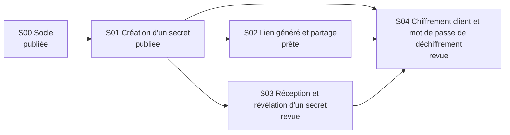

<!-- Fichier généré par /relais:roadmap — ne pas éditer : modifie les en-têtes des specs. -->
# Specs du projet

## Specs

| Spec | Titre | Vague | Dépend de | Statut | Epic | Avancement |
|---|---|---|---|---|---|---|
| S00 | [Socle](socle.md) | 0 | — | 🚀 publiée | #5 | — |
| S01 | [Création d'un secret](creation-secret.md) | 1 | S00 | 🚀 publiée | #12 | — |
| S02 | [Lien généré et partage](lien-genere-partage.md) | 2 | S01 | ✅ prête | — | — |
| S03 | [Réception et révélation d'un secret](reception-revelation.md) | 2 | S01 | 🔍 revue | — | — |
| S04 | [Chiffrement client et mot de passe de déchiffrement](chiffrement-client.md) | 3 | S01, S02, S03 | 🔍 revue | — | — |

## Vagues

- **Vague 0** : S00 Socle
- **Vague 1** : S01 Création d'un secret
- **Vague 2** : S02 Lien généré et partage · S03 Réception et révélation d'un secret
- **Vague 3** : S04 Chiffrement client et mot de passe de déchiffrement

## Dépendances

## Revue globale

- ✅ À jour, sans point bloquant.
